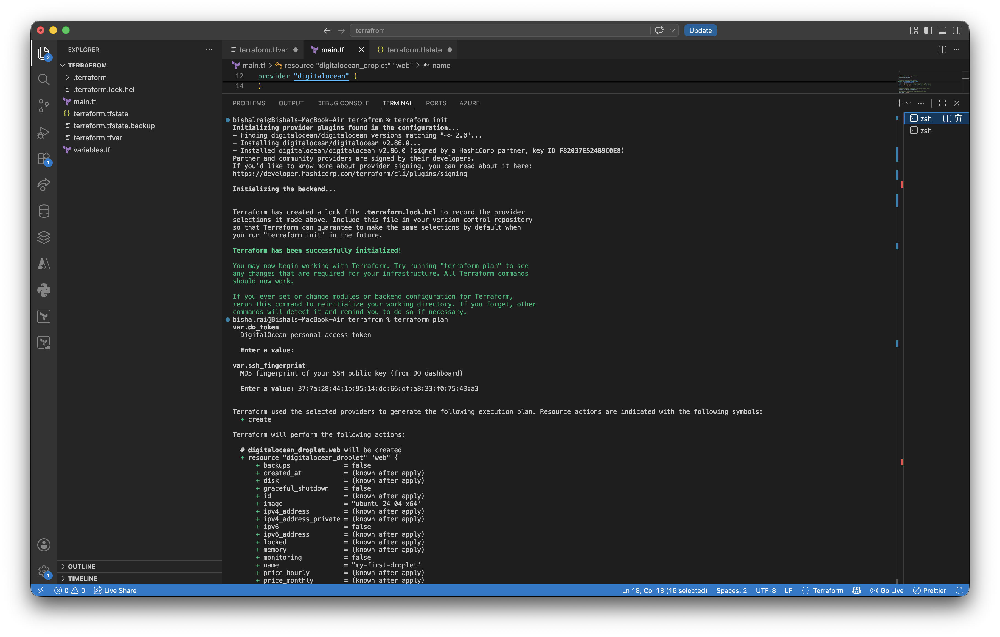
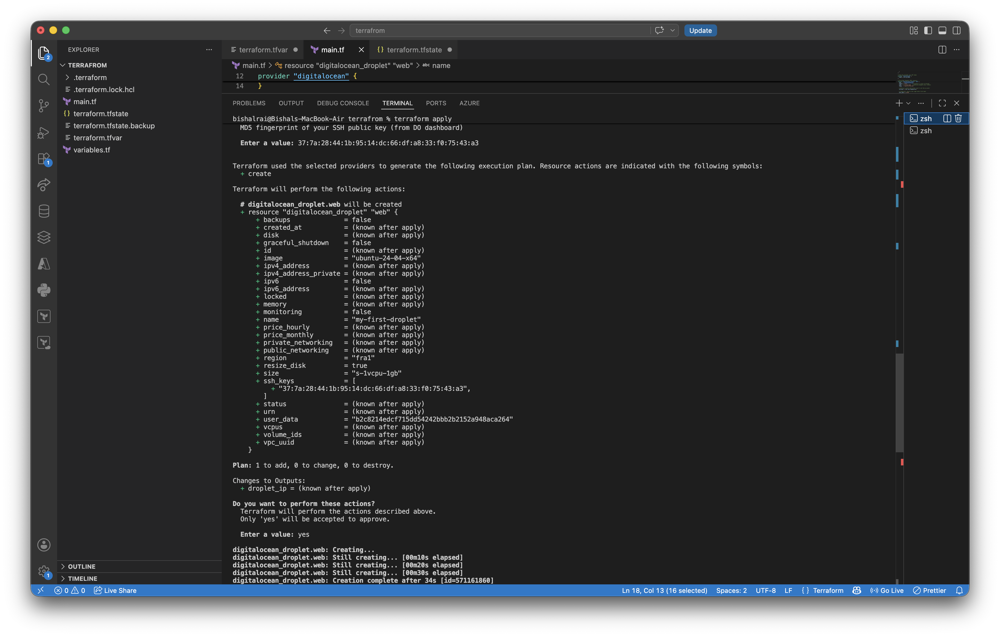
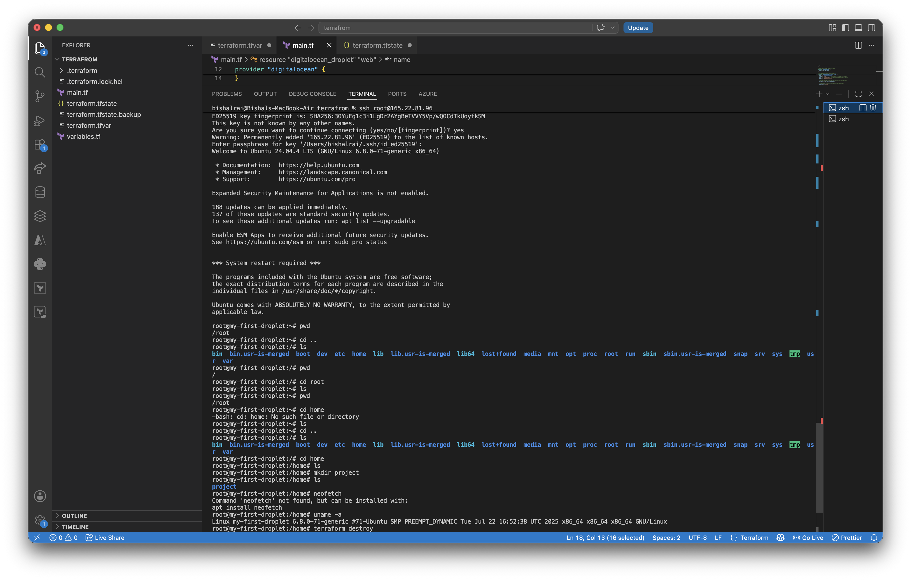
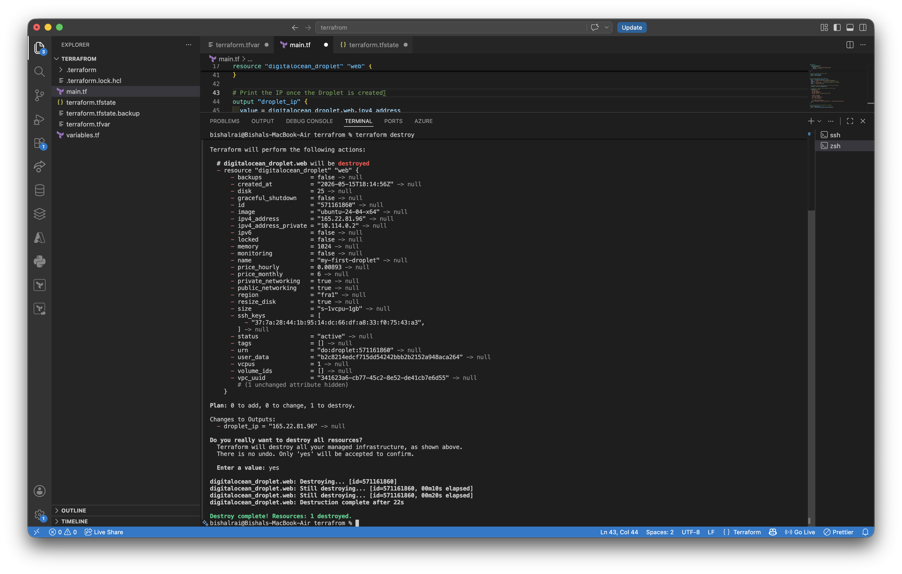

# Terraform — DigitalOcean Linux Droplet

Provisions a Ubuntu 24.04 VPS on DigitalOcean with Nginx, UFW firewall, and Git pre-installed using cloud-init.

## What this creates

| Resource | Details |
|---|---|
| Droplet | `s-1vcpu-1gb` in `fra1` (Frankfurt) |
| OS | Ubuntu 24.04 LTS |
| Packages | `nginx`, `ufw`, `git`, `htop` |
| Firewall | UFW — allows SSH + HTTP only |

## Prerequisites

- [Terraform](https://developer.hashicorp.com/terraform/install) >= 1.0
- A [DigitalOcean account](https://cloud.digitalocean.com) with an API token
- An SSH key added to your DigitalOcean account

## Setup

1. **Clone the repo**
   ```bash
   git clone https://github.com/BishalRai/terrafrom.git
   cd terraform
   ```

2. **Create your secrets file** (this is gitignored — never commit it)
   ```bash
   cp terraform.tfvars.example terraform.tfvars
   ```
   Then fill in your real values in `terraform.tfvars`.

   `do_token        = "dop_v1_YOUR_DIGITALOCEAN_TOKEN_HERE"`

   `ssh_fingerprint = "YOUR_SSH_KEY_MD5_FINGERPRINT_HERE"`

3. **Initialise Terraform** (downloads the DigitalOcean provider)
   ```bash
   terraform init
   ```

4. **Preview what will be created**
   ```bash
   terraform plan
   ```

5. **Apply**
   ```bash
   terraform apply
   ```
   Type `yes` when prompted. The Droplet IP is printed as output.

6. **SSH in**
   ```bash
   ssh root@<droplet_ip>
   ```

## Tear down

```bash
terraform destroy
```

## File structure

```
.
├── main.tf                  # Resources: Droplet definition
├── variables.tf             # Input variable declarations
├── terraform.tfvars.example # Safe template to share (no real secrets)
├── terraform.tfvars         # Your real secrets — gitignored!
└── README.md
```

## Security notes

- `terraform.tfvars` is in `.gitignore` — it must never be committed
- The state file (`terraform.tfstate`) is also gitignored — it can contain sensitive data
- For team use, store state remotely (e.g. [Terraform Cloud](https://app.terraform.io) or a DO Spaces backend)

## Demo

### 1. terraform init & plan


### 2. terraform apply


### 3. SSH into the Droplet


### 4. terraform destroy


